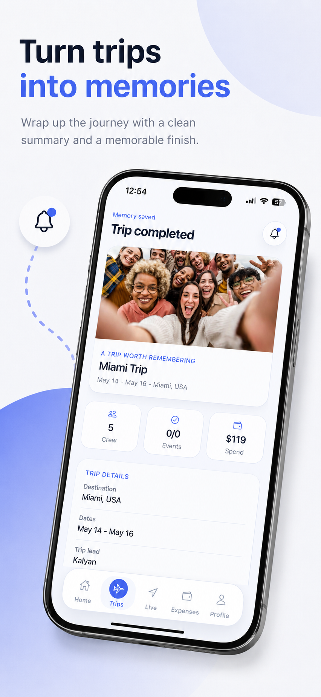
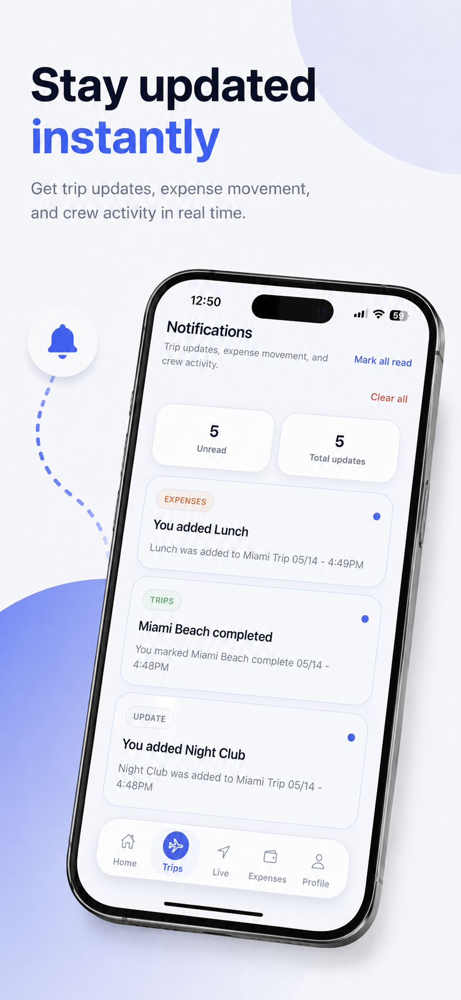
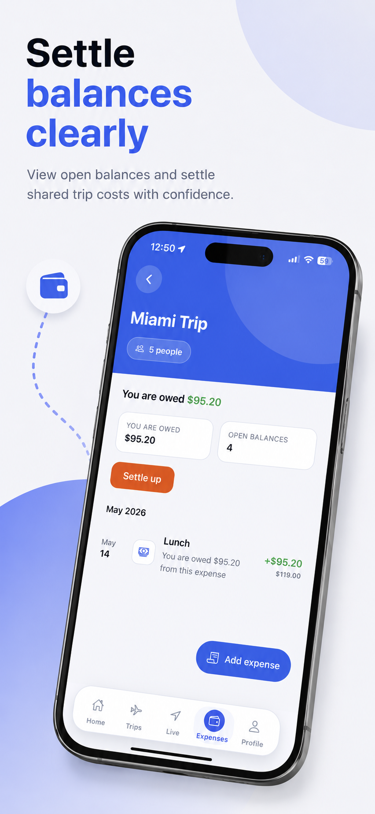
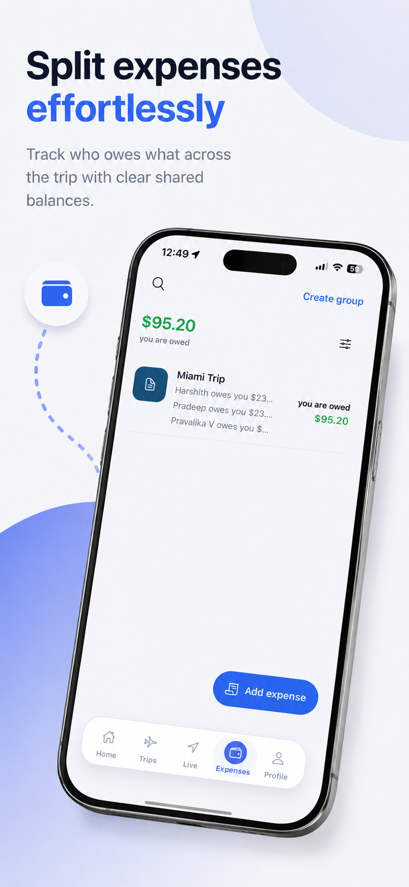
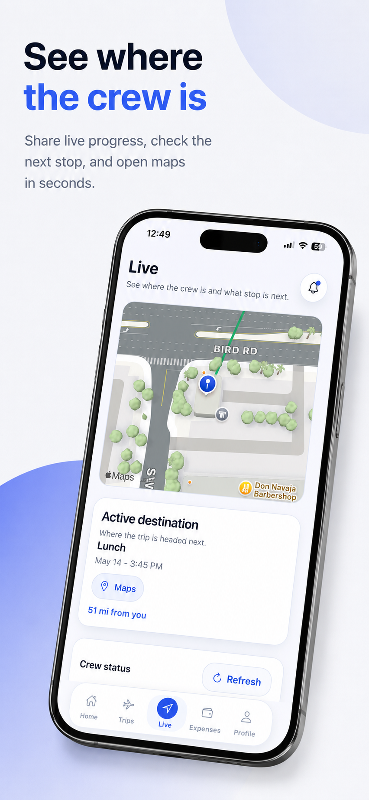
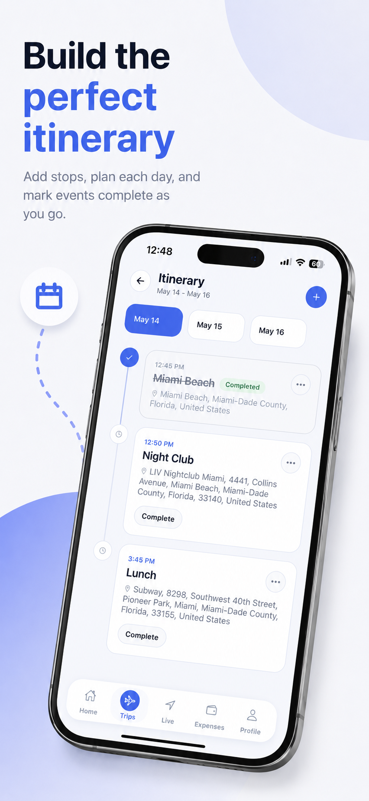
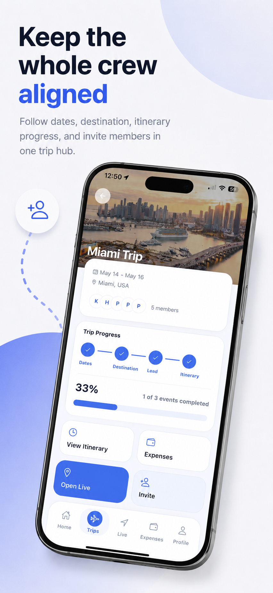
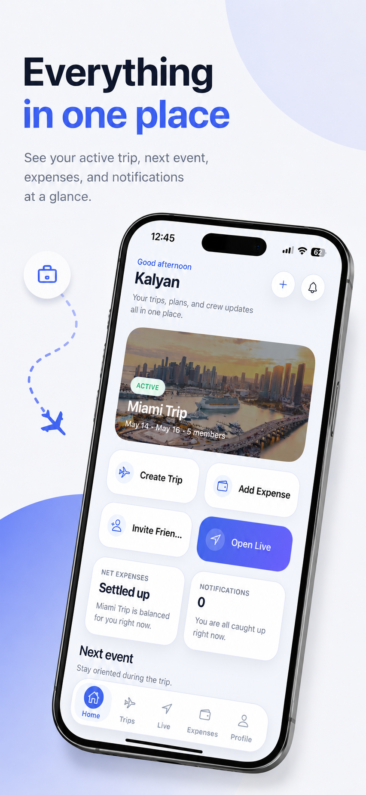
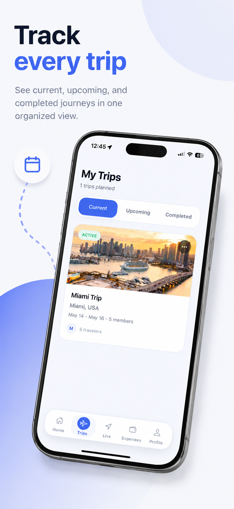
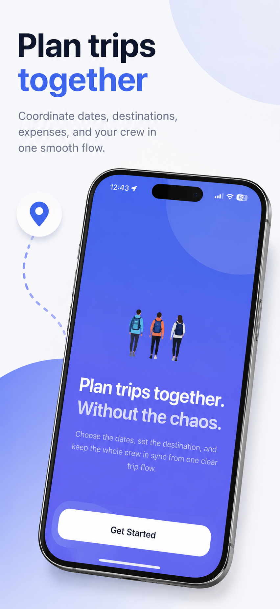

# GoTogether

<p align="center">
  
</p>

<p align="center">
  <strong>Plan trips together. Without the chaos.</strong>
</p>

<p align="center">
  GoTogether is a mobile-first group trip planning app that keeps the whole crew aligned from the first idea to the final memory.
</p>

<p align="center">
  <a href="https://apps.apple.com/us/app/gotogether-trip-planner/id6767730138"><strong>Live on the App Store</strong></a>
  &nbsp;|&nbsp;
  Play Store launch planned
  &nbsp;|&nbsp;
  Backend deployed on Google Cloud Run
</p>

<p align="center">
  
  
  
  
  
  
</p>

## The Experience

GoTogether turns messy group chats into one shared travel workspace. A trip starts with dates, destination, and crew. From there, everyone can see what is happening, build the itinerary, track live progress, split expenses, and close out the journey with a clean trip summary.

It is built for the real shape of group travel: people join late, plans change, expenses move around, and everyone needs the same source of truth.

<p align="center">
  
  
  
</p>

## Product Highlights

| What users do | How GoTogether helps |
| --- | --- |
| Plan a trip together | Create a shared trip hub for dates, destination, members, and trip progress. |
| Keep the crew aligned | Invite members manually or with reusable group-style invite links. |
| Build the itinerary | Add days, stops, locations, notes, mapped places, and mark events complete on the go. |
| See live context | Check where the crew is, what stop is next, and open maps from the Live tab. |
| Split trip costs | Track who paid, who owes, expense groups, split previews, and open balances. |
| Stay updated | Receive trip updates, expense movement, and crew activity through notifications. |
| Finish the journey | Complete trips with confirmation tracking and a memorable summary. |

<p align="center">
  
  
  
</p>

## Feature Set

**Trip planning**

- Current, upcoming, and completed trip views.
- Shared trip overview with crew, dates, destination, progress, and quick actions.
- Trip setup workflow for availability, destination decisions, and trip lead selection.
- Reusable invite links plus manual member adding.
- Member-wide collaboration for planning, with creator-only delete/remove actions.

**Itinerary and live travel**

- Day-by-day itinerary builder with events, locations, notes, and completion state.
- Event completion and undo-completion for real-time trip progress.
- AI-assisted itinerary draft generation.
- Live location updates and crew location views.
- Destination briefs, cover images, and place search support.

**Expenses and memories**

- Expense groups for organizing shared costs.
- Expense creation, editing, splitting, settlement visibility, and payer tracking.
- Linked itinerary expenses for context around meals, events, and stops.
- Trip photo uploads and profile image support.
- Trip completion flow with summary-style wrap-up.

**Trust, activity, and account**

- Firebase-backed authentication.
- Profile setup and account deletion.
- Contacts sync and friend discovery.
- Push notifications and in-app activity feed.
- Reporting and blocking tools for user safety.

<p align="center">
  
  
  
</p>

## Tech Stack

| Layer | Stack |
| --- | --- |
| Mobile app | Expo SDK 54, React Native 0.81, React 19, TypeScript |
| Navigation | React Navigation native stack and bottom tabs |
| State | Zustand |
| Auth | Firebase Authentication with backend ID token verification |
| Push | Expo Notifications |
| Native capabilities | Contacts, Location, Image Picker, Haptics, Device, Maps |
| Backend | Go 1.25 with Gin |
| Database | PostgreSQL on Google Cloud SQL |
| Storage | Google Cloud Storage for profile images, trip covers, and trip photos |
| Cloud runtime | Google Cloud Run with Cloud Build and Artifact Registry |
| External services | Twilio SMS, Google Places, OpenStreetMap, OpenAI, Pexels, Unsplash |
| Release | EAS Build and App Store Connect |
| Prototype surface | Vite, React, Tailwind CSS, shadcn/ui, Radix UI |

## Architecture

```text
Expo React Native App
        |
        | Firebase ID token
        v
Go API on Google Cloud Run
        |
        | PostgreSQL data
        v
Google Cloud SQL
        |
        | media assets
        v
Google Cloud Storage
```

The mobile app talks to a Go API deployed on Cloud Run. Firebase handles identity, while the backend owns trip data, permissions, invites, itinerary, expenses, notifications, reports, media references, and integration workflows.

## Services And Deployment Footprint

- **Apple App Store:** iOS app is publicly listed as GoTogether Trip Planner.
- **Google Play Store:** Android package is configured and Play Store launch is planned.
- **Google Cloud Run:** production backend hosting.
- **Google Cloud SQL:** PostgreSQL persistence for users, trips, members, itinerary, expenses, notifications, reports, and safety data.
- **Google Cloud Storage:** uploaded profile images, trip covers, and trip memories.
- **Firebase:** authentication and mobile Firebase configuration.
- **Expo/EAS:** native mobile builds and App Store release pipeline.
- **Twilio:** SMS invite support.
- **OpenAI:** AI-assisted planning and destination/media workflows.
- **Google Places, OpenStreetMap, Pexels, Unsplash:** destination, place, and cover-image enrichment.

## Repository Map

```text
.
|-- mobile-app/        Production Expo React Native app
|-- backend/           Go API service and database schema
|-- src/               Original Vite/React prototype surface
|-- docs/              README visuals and project presentation assets
`-- PROJECT_STATE.md   Historical project notes
```

## Why This Project Stands Out

GoTogether is not just a UI prototype. It is a released mobile product with native app distribution, authenticated users, a real backend, cloud deployment, database persistence, media storage, notifications, SMS invites, AI-assisted planning, and a clear product loop from trip creation to trip completion.

It shows full-stack product execution across mobile UX, backend architecture, cloud infrastructure, release engineering, and the practical details that make collaborative apps feel alive.
